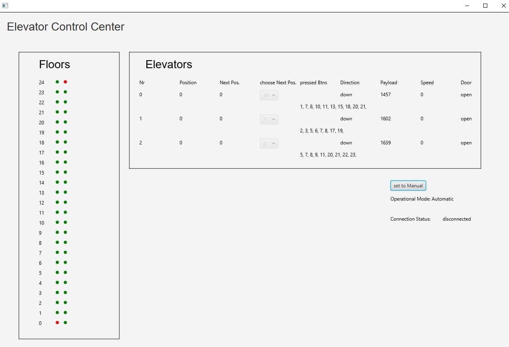

# Elevator Control Center

## SonarCloud Status

## Download

### Prerequisites

https://github.com/winterer/elevator

### Execute

JRE v16.0 or higher

java -jar target\ecc-team-a-0.0.1-SNAPSHOT-shaded.jar
(located in the release page)

## How to build it

mvn clean javafx:run ... to run Apllication from within your IDE

mvn clean test ...  to run TestCases from within your IDE

mvn clean package ... to build standalone JAR-Files into the target-folder

## GUI
The ECC-GUI contains a section for Floors and a section for the Elevators. Upon connection with the ElevatorSimulator the GUI is filled with the gathered Data. Floors give their Button status with green(pressed) and red(not pressed). The Elevators are organised in a list. The manual mode gives the opportunity to control the elevators with the corresponding drop down menu. For each Elevator the current position, the next position as well as other parameters like payload or speed are displayed. The button is for switching between Automatic/and Manual mode. NOTE: The automatic mode is not implemented yet and therefore fulfills no purpouse.

## Architecture

The following image shows the software-architecture of the elevator control center (only constructors are displayed in the classes)

